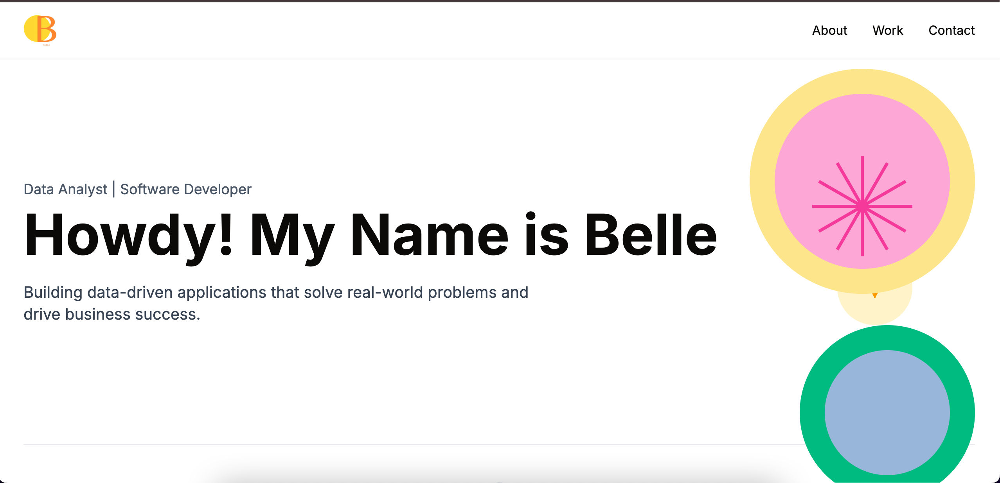

# Belle's Portfolio

A modern, responsive portfolio website built with Next.js, TypeScript, TanStack Query, and Supabase.



[Deployed Site](https://belle-portfolio.vercel.app/)

## 🚀 Features

- **Responsive Design** - Optimized for all device sizes
- **Project Showcase** - Display your projects with images and descriptions
- **Contact Form** - Allow visitors to send messages directly through Formspree
- **Animated UI Elements** - Engaging user experience with smooth animations
- **SEO Optimized** - Built with best practices for search engine visibility
- **TypeScript** - Type-safe code for better development experience
- **TanStack Query** - Efficient data fetching and state management
- **Supabase Integration** - Database for storing and retrieving projects

## 📋 Technologies Used

### **Frontend**
- Next.js 15.x (App Router)
- TypeScript
- TailwindCSS
- React Icons
- TanStack Query (React Query)

### **Backend**
- Supabase (PostgreSQL)
- Formspree (Contact Form)

### **Deployment**
- Vercel

## 🛠️ Installation & Setup

1. **Clone the repository**
   ```bash
   git clone https://github.com/bduran04/belle-portfolio.git
   cd belle-portfolio
   ```
2. **Install dependencies**
   ```bash
   npm install
   ```
3. **Set up environment variables**
   
   Create a `.env.local` file in the root directory with the following variables:
   ```plaintext
   NEXT_PUBLIC_SUPABASE_URL=your_supabase_url
   NEXT_PUBLIC_SUPABASE_ANON_KEY=your_supabase_anon_key
   NEXT_PUBLIC_FORMSPREE_ENDPOINT=your_formspree_endpoint
   ```
4. **Run the development server**
   ```bash
   npm run dev
   ```
   Open [http://localhost:3000](http://localhost:3000) in your browser.

## 🔄 Data Structure

### **Projects Table Schema**

The Supabase database contains a `projects` table with the following structure:

| Column Name  | Type      | Description                        |
|-------------|----------|------------------------------------|
| id          | uuid     | Primary key                        |
| title       | text     | Project title                      |
| description | text     | Project description                |
| image_url   | text     | URL to project image               |
| tags        | jsonb    | Array of technologies used         |
| demo_url    | text     | Link to live demo (optional)       |
| repo_url    | text     | Link to repository (optional)      |
| created_at  | timestamp | Creation timestamp                 |

## 🚢 Deployment

This portfolio is configured for deployment on **Vercel**:

1. Push your code to a GitHub repository
2. Connect your repository to Vercel
3. Set up the environment variables in the Vercel dashboard
4. Deploy!

## 💼 Adding Projects

Projects can be added through the **Supabase dashboard**:

1. Log in to your Supabase dashboard
2. Navigate to the `projects` table
3. Add a new row with your project details
4. The changes will automatically reflect on your website

## 📝 Contact Form

The contact form uses **Formspree** to handle submissions:

1. Create an account on [Formspree](https://formspree.io/)
2. Create a new form and get your form endpoint
3. Set the endpoint in your environment variables

## 🧩 Customization

- Edit the content in `app/page.tsx` to update your personal information
- Modify styles in the TailwindCSS classes to match your preferred color scheme
- Update images in the `public/images` directory

## 📄 License

This project is licensed under the MIT License - see the [LICENSE](./LICENSE) file for details.

## 🙏 Acknowledgements

- [Next.js](https://nextjs.org/)
- [Supabase](https://supabase.com/)
- [TanStack Query](https://tanstack.com/query)
- [TailwindCSS](https://tailwindcss.com/)
- [Formspree](https://formspree.io/)
